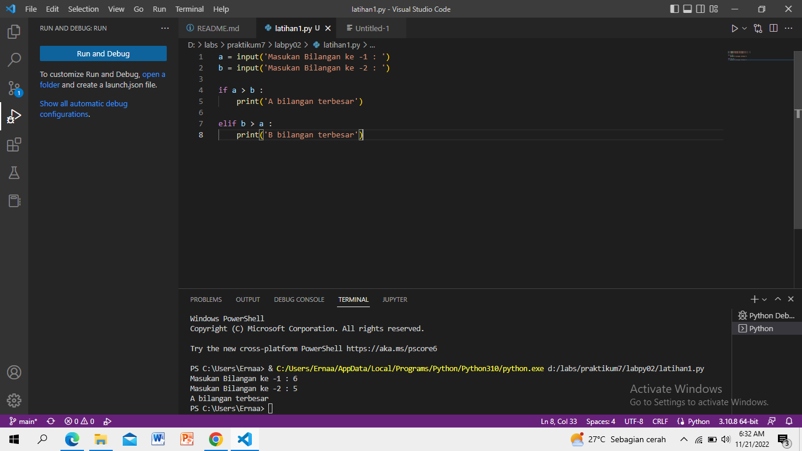
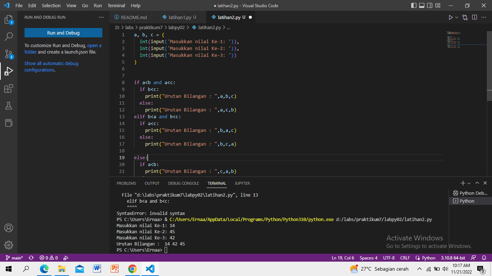
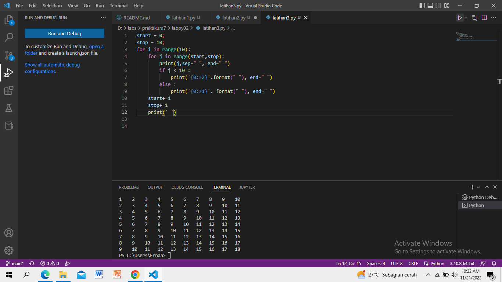
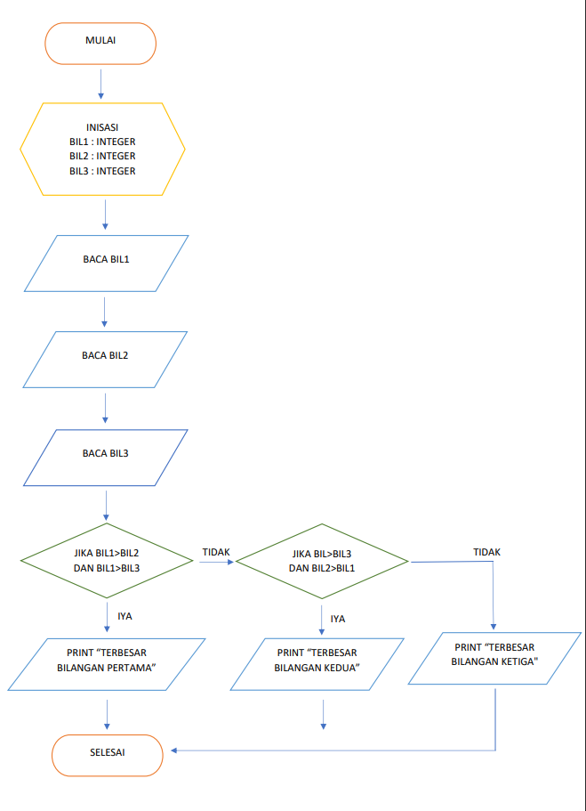
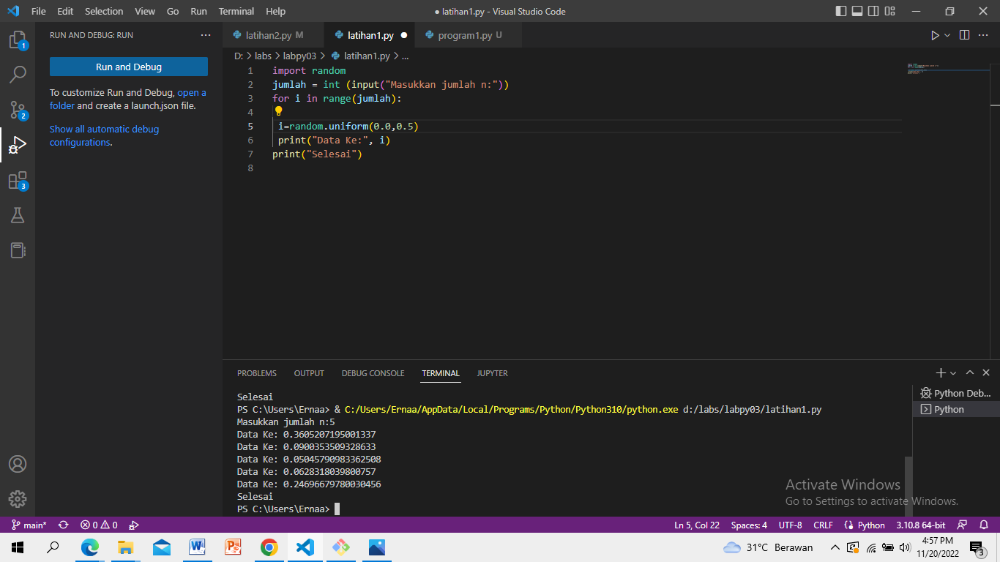
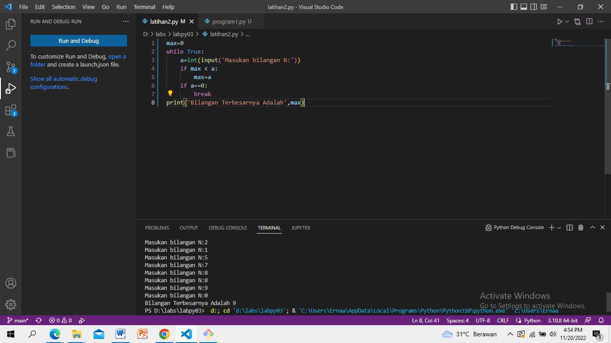
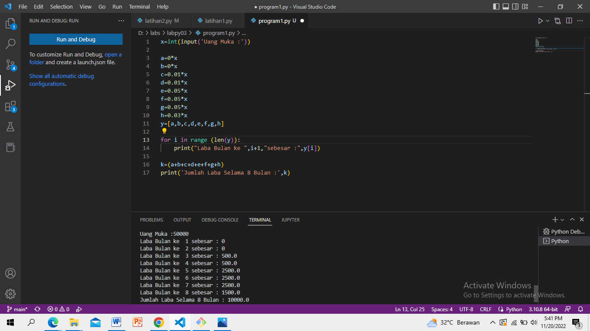

# Struktur Kondisi dan Perulangan
## LATIHAN 1
## MEMBUAT PROGRAM DENGAN MENGINPUT 2 BUAH BILANGAN UNTUK MENENTUKAN BILANGAN TERBESAR MENGGUNAKAN STATEMENT IF

# Source Code & Output (Hasil Running Program)

# LATIHAN 2
## MEMBUAT PROGRAM UNTUK MENGURUTKAN DATA SECARA BERURUTAN MULAI DARI DATA TERKECIL

# Source Code & Output (Hasil Running Program)

# LATIHAN PERULANGAN
## MEMBUAT PROGRAM DENGAN PERULANGAN BERTINGKAT 

# Source Code & Output (Hasil Running Program)

# Tugas Praktikum 2
## MENENTUKAN BILANGAN TERBESAR DARI 3 BUAH BILANGAN MENGGUNAKAN STATEMENT IF
# Flowchart
1. Mulai 
2. Inisiasi Bil 1, Bil 2, Bil 3 sebagai Integer
3. Baca Bil 1
4. Baca BIl 2
5. Baca Bil 3
6. Jika Bil 1 > Bil 2 dan Bil 1 > Bil 3, Maka Kerjakan Langkah 8, Selain itu
7. Jika Bil 2 > Bil 1 dan Bil 2 > Bil 3, Maka Kerjakan Langkah 9, Selain Itu Kerjakan Langkah 10
8. Cetak "Bilangan Terbesar Bilangan  Pertama"
9. Cetak "Bilangan Terbesar Bilangan Kedua"
10. Cetak "Bilangan Terbesar Bilangan Ketiga"
11. Selesai

 # Source Code & Output (Hasil Running Program)
 

 # Labspy03
 ## LATIHAN 1 
 ## MENAMPILAN BILANGAN ACAK YANG LEBIH KECIL DARI 0,5
 # Source Code & Output ( Hasil Running Program )
 # *Menggunakan fungsi random() untuk membangkitkan nilai random
 

 # Penjelasan 
 1. # "print" : berfungsi untuk mencetak atau menampilkan objek ke perangkat keluaran (layar) atau ke file teks.
 2. # "import" : fungsi lanjut yang dipanggil oleh statement import.
 3. # "random" : untuk menentukan suatu pilihan.
 4. # "range" : merupakan fungsi yang menghasilkan list. Fungsi ini akan menciptakan sebuah list baru dengan rentang nilai tertentu.
 5. # "uniform": digunakan untuk menampilkan bilangan float random dengan batas awal bilangan x, dan batas akhir bilangan y. 

## LATIHAN 2 
## MENAMPILKAN BILANGAN TERBESAR DARI BUAH DATA YANG DIINPUTKAN LALU ANGKA 0 UNTUK BERHENTI
# Source Code & Output (Hasil Running Program)

# Penjelasan
1. # "max" : fungsi bulid-in untuk mencari nilai tertinggi. Fungsi ini dapat diberikan sebuah parameter berupa angka.
2. # "while" : disebut uncounted loop (perulangan yang tak terhitung), untuk perulangan yang memiliki syarat dan tidak tentu berapa banyak perulangannya.
3. # "int" : berfungsi mengkonversi bilangan maupun string angka menjadi bilangan bulat (integer).
4. # "if" = Bila suatu kondisi tertentu tercapai maka apa yang harus dilakukan. Dengan fungsi ini kita bisa menjalankan suatu perintah dalam kondisi tertentu.
5. # "input" : masukan yang kita berikan ke program.
6. # "break" : fungsi yang menghentikan operasi dibawahnya jika suatu kondisi yang ditentukan telah tercapai.
7. # "print" : berfungsi untuk mencetak atau menampilkan objek ke perangkat keluaran (layar) atau ke file teks.

## PROGRAM 1 
## PROGRAM SEDERHANA DENGAN PERULANGAN
Seorang pengusaha menginvestasikan uangnya untuk memulai usahanya dengan
modal awal 100 juta, pada bulan pertama dan kedua belum mendapatkan laba. pada
bulan ketiga baru mulai mendapatkan laba sebesar 1% dan pada bulan ke 5,
pendapatan meningkat 5%, selanjutnya pada bulan ke 8 mengalami penurunan
keuntungan sebesar 2%, sehingga laba menjadi 3%. Hitung total keuntungan selama 8
bulan berjalan usahanya.

# Souce Code dan Output (Hasil Running Program)

# Penjelasan
1. # masukkan nilai a
2. # gunakan for untuk perulangan dari 1 sampai 8.Perulangan for disebut counted loop (perulangan yang terhitung)
3. # lalu gunakan if pertama untuk menentukan laba bulan ke 1 dan ke 2.masukan variabel (b) kalikan nilai (a) dengan data bulan 1 dan 2. cetak (x) dan (b)
4. # lalu gunakan if kedua untuk menentukan laba bulan ke 3 dan ke 4.masukan variabel (b) kalikan nilai (a) dengan data bulan 3 dan 4. cetak (x) dan (c)
5. # lalu gunakan if ketiga untuk menentukan laba bulan ke 5 sampai ke 7.masukan variabel (b) kalikan nilai (a) dengan data bulan 5 sampai 7. cetak (x) dan (d)
6. # lalu gunakan if keempat untuk menentukan laba bulan ke 8.masukan variabel (b) kalikan nilai (a) dengan data bulan 8. cetak (x) dan (e)
7. # lalu total keseluruhan.
8. # cetak total

## TERIMKASIH :)

